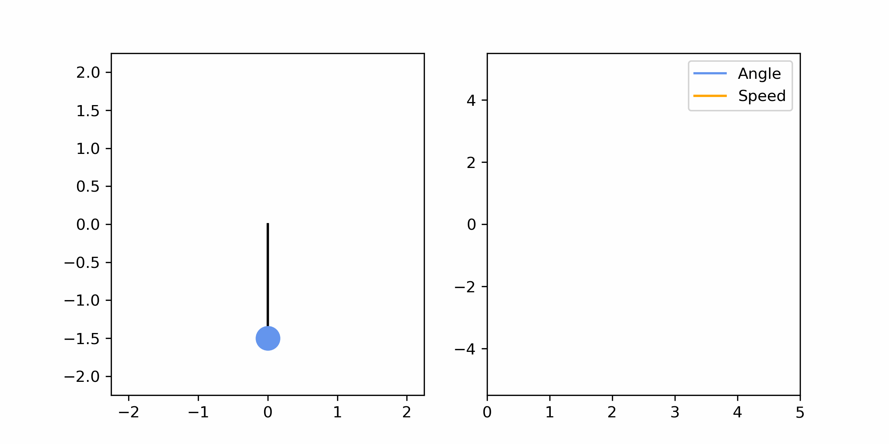
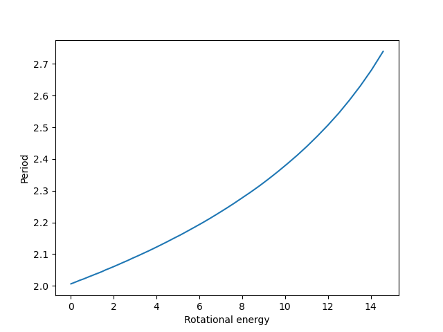

# Homework 4 - Simple pendulum

In the fourth homework we implemented a simple undamped pendulum. 
Its angle $\theta(t)$ is defined with the differential equation
$$\frac{g}{l}sin(\theta(t)) + \theta''(t) = 0 $$
where $g$ is the acceleration due to Earth's gravity and $l$ is the length of the pendulum. 
The differential equation is solved using the method Runge-Kutta of the 4th order.

Below we show the pendulum swinging and show its angle and angular speed through time.

Next, we compare the simple pendulum with the harmonic pendulum (harmonic oscillator), which has a simple solution under the restriction that the 
size of the oscillation's amplitude is much less than 1 radian. 

Under the assumption that,
$$\theta \ll 1, $$
we can use the small-angle approximation for sine function,
$$sin \theta \approx \theta,$$
which yields the equation for harmonic oscillator,
$$\frac{g}{l}\theta(t) + \theta''(t) = 0. $$

